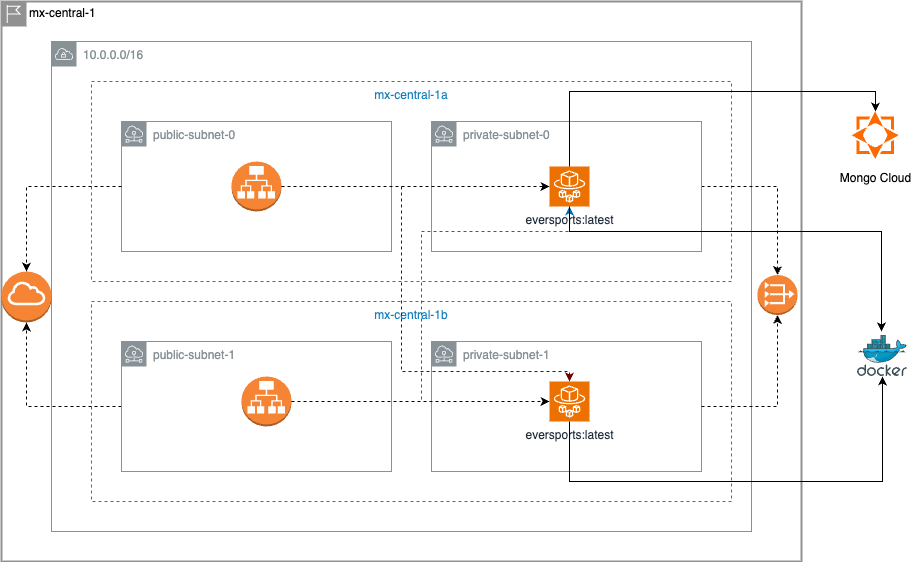
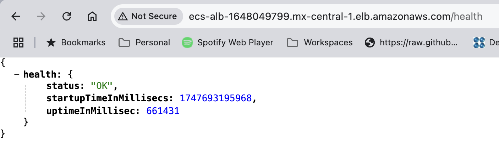
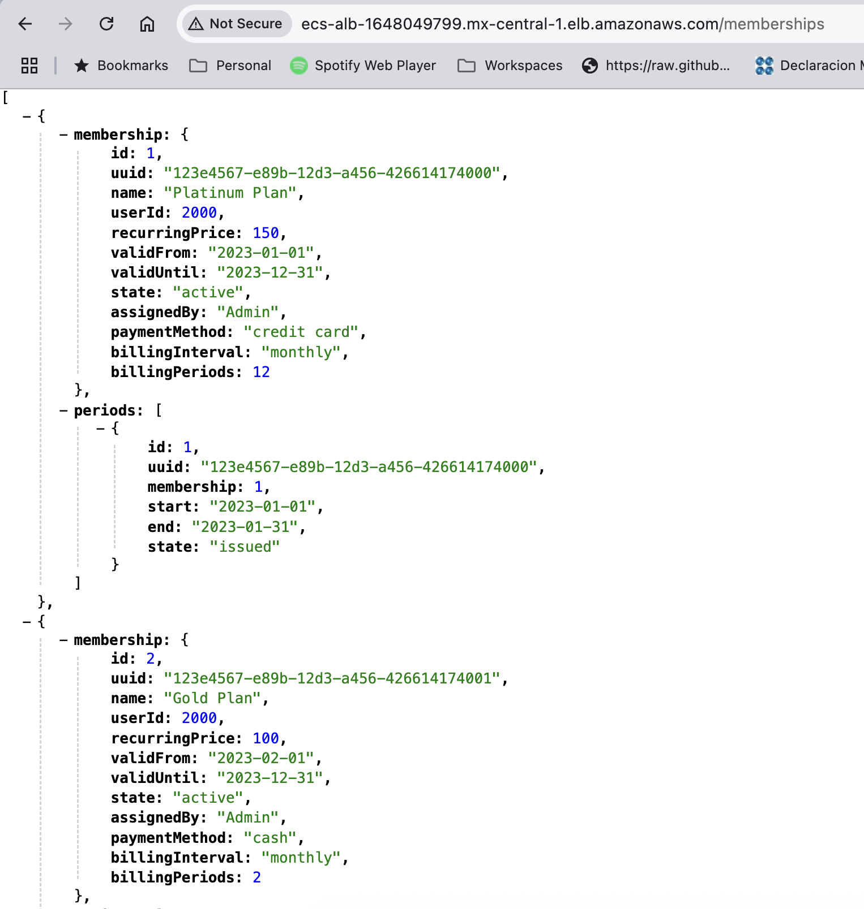
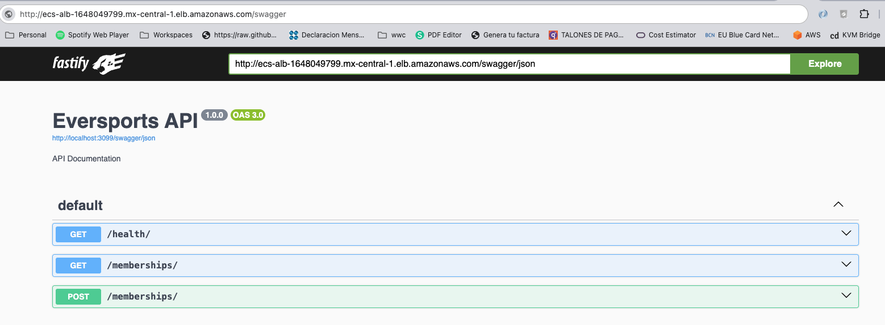
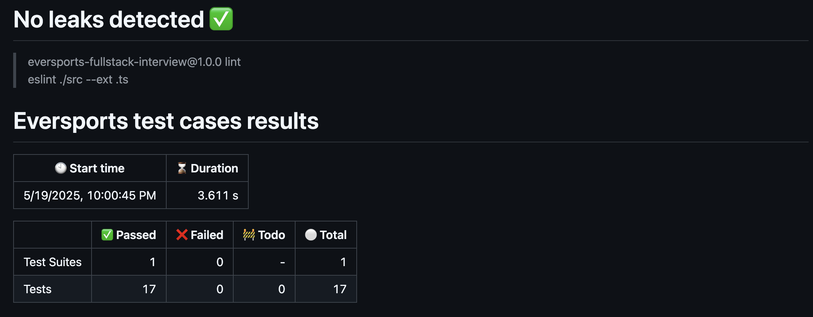
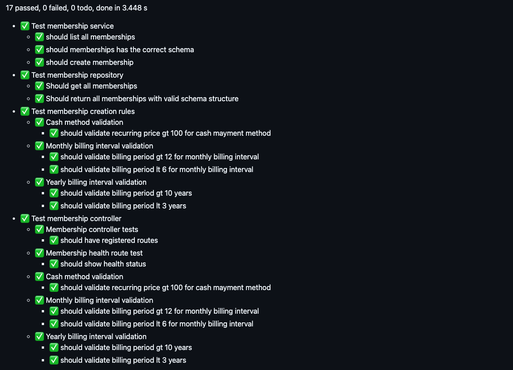
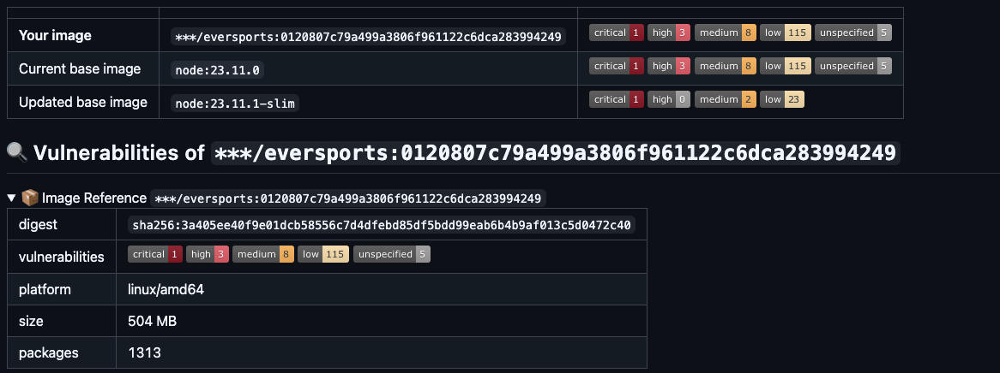
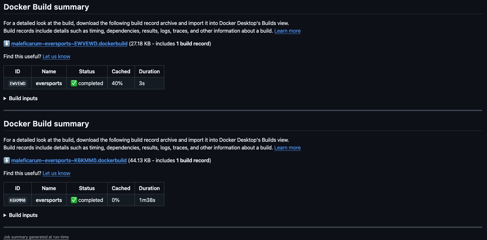
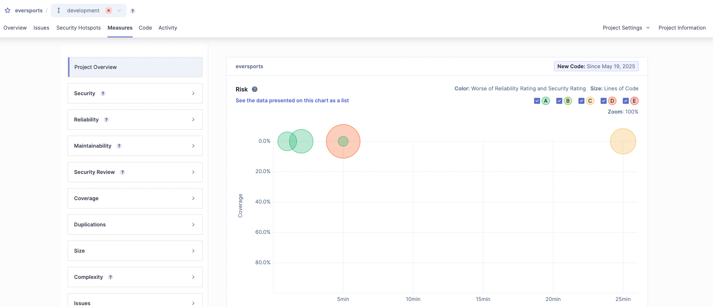

# Eversports Membership API 🚀


## Context

Modern membership management API refactored from legacy Express.js to FastAPI/TypeScript with clean architecture principles.

## ✨ Features

### Membership Management
- ✅ Create new memberships
- ✅ List all memberships

### Modern Architecture
- 🧹 Clean code refactor from legacy Express.js
- 🏗️ Separation of concerns

## 🏗️ Project Structure

According the **separation of concerns** principle, the project has the next structure : 

```bash
📂 src/
├── 📂 config
├── 📂 data
├── 📂 legacy
│   └── 📂 routes
└── 📂 modern
    ├── 📂 controller
    ├── 📂 model
    │   └── 📂 schemas
    │       ├── 📂 db
    │       │   └── 📂 mongo
    │       └── 📂 request
    ├── 📂 repository
    │   └── 📂 interfaces
    ├── 📂 server
    ├── 📂 services
    └── 📂 utils
        ├── 📂 factory
        │   └── 📂 impl
        └── 📂 validators
            └── 📂 rules
```

* **src/legacy** : The legacy codebase
* **src/config** : The base parameters for the application.
* **src/modern** : The new version
* **src/modern/controller** : The REST controllers with the proper routes.
* **src/modern/model** : The DB model for each entity (Membership, MembershipPeriod)
* **src/modern/model/schemas/db/mongo/** : This contains the specific Models for mongo, which defines the requirements and restrictions.
* **src/modern/model/schemas/db/request/** : This contains the specific schemas to be validated by the API server, and defines the specific and expected payload in the request.
* **src/modern/repository** : The repositories to interact with the data source. Has the proper methods to create or list entities.
* **src/modern/server** : This holds the specific server to expose the API's. The initial version implements Fastify, but may be changed to NextJS or express.js if needed.
* **src/modern/services** : The services definition, which holds the binding between Controllers and Repositories.
* **src/modern/utils/factory** : The factories classes to create entities as needed in a singleton fashion.
* **src/modern/utils/validators** : The business rules validators.

## 🛠️ Tech Stack

### Frameworks and libraries

**Backend**
- Fastify (High-performance web framework)
- MongoDB Atlas (Fully-managed cloud database)
- Mongoose (ODM for MongoDB)

**Infrastructure**
- 🐳 Docker (Containerization)
- ⚙️ Terraform + Terragrunt (IaC)
- 🚀 AWS Fargate (Serverless containers)
- 🔗 API Gateway + ALB (Traffic management)
- 🔄 GitHub Actions (CI/CD)

## 🚀 Getting Started

### Prerequisites
- Node.js v18+
- Docker Desktop
- AWS CLI configured
- Terraform v1.2+

### Configuration

> [!IMPORTANT]
> The application has its own predefined variables (`src/config/config.ts`), but would be need to adjust the values.

To adjust the configuration, edit the config file (`src/config/config.ts`) or set the corresponding environment variable : 

```typescript
export const AppConfig = {
    HTTP_LISTENING_PORT: 3099,
    HTTP_LISTENING_ADDRESS: "0.0.0.0",
    APPLICATION_ENVIRONMENT: "production",
    EVERSPORTS_API_VERSION: "1.0.0",
} as const satisfies { HTTP_LISTENING_PORT: number, HTTP_LISTENING_ADDRESS: string, APPLICATION_ENVIRONMENT: string, EVERSPORTS_API_VERSION: string }
```

or

```bash
export HTTP_LISTENING_PORT=9090
```

### Instalation

1. **Clone the repository**

```bash
$ git clone git@github.com:maleficarum/eversports.git
cd eversports
```

2. **Install dependencies**

```bash
$ npm install
```

3. **Run the server**

Theres three options tu startup the server 

a) ***Dev mode***

This mode listen for changes and performs a restart to apply the changes.

```bash
$ npm run dev
```

b) ***Non-compiled startup***

This mode starts the server with no compilation neede, and no 'listening for changes' mode.

```bash
$ npm run start
```

c) ***Compiled/production mode***

This mode runs a compiled version; starts a plain javascript version of the project.

```bash
$ npm run build && npm run serve
```

> [!NOTE]
> To run the compiled version you need tu run the 'build' task before.

### Deployment

This project it's ready to be deployed on AWS according the next architecture : 



The stack is located in the 'stack' 📂 directory organized as follows :

```bash
📂 stack/
├── 📂 environments
│   └── 📂 development
│       ├── 📂 api_gateway
│       ├── 📂 network
│       └── 📂 private-container
└── 📂 modules
    ├── 📂 terraform-aws-api-gateway
    ├── 📂 terraform-aws-container
    └── 📂 terraform-aws-network
```

> [!NOTE]
> You don't have to edit or modify the artifacts under "modules" 📂 directory. That directory is only for your reference.

> [!IMPORTANT]
> For this stage, only de ***development*** environment is configured, but if it is needed, you can add more environments at the same level of the ***development*** 📂 directory.

> [!IMPORTANT]
> You need to configure the proper keys to access to your AWS account [see documentation](https://docs.aws.amazon.com/cli/v1/userguide/cli-configure-files.html).

#### Terraform AWS configuration

You can set specific region to deploy the stack. Each module under 📂**environments/[environment]** has its own env.hcl file with the specific configuration for the module : 

```hcl
locals {
    region = "mx-central-1"
    s3_region = "us-east-1"
    environment = "development"
    terraform_module_version = "v0.0.6"
}
```

> [!IMPORTANT]
> Each module has it's own published artifact. To get informed about the current version :
> [Fargate Module](https://github.com/maleficarum/terraform-aws-container/releases)
> [API Gateway Module](https://github.com/maleficarum/terraform-aws-api-gateway/releases)
> [Network Module](https://github.com/maleficarum/terraform-aws-network/releases)


You can (or not) adjust this values.

#### Terraform apply

Before starting creating the deployment, it is a good idea to perform a plan to get informed about the changes the stack will do, or any error if exists.

```bash
$ cd stack/environments/development/
$ terragrunt run-all plan

16:25:01.357 INFO   The stack at . will be processed in the following order for command apply:
Group 1
- Module ./network

Group 2
- Module ./api_gateway
- Module ./private-container

Are you sure you want to run 'terragrunt apply' in each folder of the stack described above? (y/n)
```

type **yes** and the plan task will be performed. Once the plan is done, you will get a brief of all task terraform will perform. If there is no error, you can apply all the stack.

```bash
$ terragrunt run-all apply

16:27:40.546 INFO   The stack at . will be processed in the following order for command apply:
Group 1
- Module ./network

Group 2
- Module ./api_gateway
- Module ./private-container


Are you sure you want to run 'terragrunt apply' in each folder of the stack described above? (y/n)
```

type **yes** and the apply task will be performed. Once the apply is done, you will get a brief of all task to be done on AWS.

```bash
...
16:28:31.059 STDOUT [network] terraform:
16:28:31.059 STDOUT [network] terraform: Terraform has compared your real infrastructure against your configuration
16:28:31.059 STDOUT [network] terraform: and found no differences, so no changes are needed.
16:28:31.329 STDOUT [network] terraform:
16:28:31.329 STDOUT [network] terraform: Apply complete! Resources: 0 added, 0 changed, 0 destroyed.
16:28:31.329 STDOUT [network] terraform:
16:28:31.329 STDOUT [network] terraform: Outputs:
16:28:31.329 STDOUT [network] terraform:
16:28:31.329 STDOUT [network] terraform: ecs_tasks = "sg-07b045e209d46fba5"
16:28:31.329 STDOUT [network] terraform: private_subnets = [
16:28:31.329 STDOUT [network] terraform:   "subnet-095abe0ff054985b2",
16:28:31.329 STDOUT [network] terraform:   "subnet-0a430f722ab0e3ae7",
16:28:31.329 STDOUT [network] terraform: ]
16:28:31.329 STDOUT [network] terraform: public_alb_dns_name = "ecs-alb-1648049799.mx-central-1.elb.amazonaws.com"
16:28:31.329 STDOUT [network] terraform: public_subnets = [
16:28:31.329 STDOUT [network] terraform:   "subnet-0371b0f07b161124a",
16:28:31.329 STDOUT [network] terraform:   "subnet-07f17522e0f7271d8",
16:28:31.329 STDOUT [network] terraform: ]
16:28:31.329 STDOUT [network] terraform: target_group_arn = "arn:aws:elasticloadbalancing:mx-central-1:648047645567:targetgroup/ecs-target-group/241a4fa693634fa4"
16:28:31.329 STDOUT [network] terraform: vpc = "vpc-0ee894ce01305b7fb"
...
16:28:37.429 STDOUT [private-container] terraform: Apply complete! Resources: 0 added, 0 changed, 0 destroyed.
16:28:37.429 STDOUT [private-container] terraform:
16:28:37.449 STDOUT [api_gateway] terraform:
16:28:37.449 STDOUT [api_gateway] terraform: Apply complete! Resources: 0 added, 0 changed, 0 destroyed.
16:28:37.449 STDOUT [api_gateway] terraform:
16:28:37.449 STDOUT [api_gateway] terraform: Outputs:
16:28:37.449 STDOUT [api_gateway] terraform: api_gateway_fqdn = "dgf7mxlcx1.execute-api.mx-central-1.amazonaws.com"
```

The most relevan part after the apply command are the outputs. If you missed the outputs output, you can perform :

```bash
$ terragrunt run-all output

Group 1
- Module ./network

Group 2
- Module ./api_gateway
- Module ./private-container


ecs_tasks = "sg-07b045e209d46fba5"
private_subnets = [
  "subnet-095abe0ff054985b2",
  "subnet-0a430f722ab0e3ae7",
]
public_alb_dns_name = "ecs-alb-1648049799.mx-central-1.elb.amazonaws.com"
public_subnets = [
  "subnet-0371b0f07b161124a",
  "subnet-07f17522e0f7271d8",
]
target_group_arn = "arn:aws:elasticloadbalancing:mx-central-1:648047645567:targetgroup/ecs-target-group/241a4fa693634fa4"
vpc = "vpc-0ee894ce01305b7fb"
╷
│ Warning: No outputs found
│
│ The state file either has no outputs defined, or all the defined outputs
│ are empty. Please define an output in your configuration with the `output`
│ keyword and run `terraform refresh` for it to become available. If you are
│ using interpolation, please verify the interpolated value is not empty. You
│ can use the `terraform console` command to assist.
╵
api_gateway_fqdn = "dgf7mxlcx1.execute-api.mx-central-1.amazonaws.com"
```

After the creation of the resources the outputs will be available at any momento; you can get the final API Gateway and Public Load Balancer FQDN.


## 🧪 Testing

### Unit tests

To execute the test cases, just type : 

```bash
$ npm run test

> eversports-fullstack-interview@1.0.0 test
> jest --runInBand --detectOpenHandles

{"name":"MembershipValidator","hostname":"mayhem.local","pid":23959,"level":50,"msg":"Invalid membership recurring prices { recurringPrice: 101, paymentMethod: 'cash' }","time":"2025-05-19T22:54:02.296Z","v":0}
{"name":"MembershipValidator","hostname":"mayhem.local","pid":23959,"level":50,"msg":"Monthly billing periods exceed maximum { billingPeriods: 13, maximum: 12 }","time":"2025-05-19T22:54:02.298Z","v":0}
{"name":"MembershipValidator","hostname":"mayhem.local","pid":23959,"level":50,"msg":"Monthly billing periods below minimum { billingPeriods: 5, minimum: 6 }","time":"2025-05-19T22:54:02.299Z","v":0}
{"name":"MembershipValidator","hostname":"mayhem.local","pid":23959,"level":50,"msg":"Yearly billing periods exceed maximum { billingPeriods: 11, maximum: 10 }","time":"2025-05-19T22:54:02.300Z","v":0}
{"name":"MembershipValidator","hostname":"mayhem.local","pid":23959,"level":50,"msg":"Yearly billing periods below minimum { billingPeriods: 2, minimum: 3 }","time":"2025-05-19T22:54:02.300Z","v":0}
 PASS  test/main.test.ts
  Test membership repository
    ✓ Should get all memberships (2 ms)
    ✓ Should return all memberships with valid schema structure (2 ms)
  Test membership creation rules
    Cash method validation
      ✓ should validate recurring price gt 100 for cash mayment method (4 ms)
    Monthly billing interval validation
      ✓ should validate billing period gt 12 for monthly billing interval
      ✓ should validate billing period lt 6 for monthly billing interval (1 ms)
    Yearly billing interval validation
      ✓ should validate billing period gt 10 years (1 ms)
      ✓ should validate billing period lt 3 years (1 ms)


jest-md-dashboard: Dashboard is generated to /Users/maleficarum/projects/maleficarum/challenges/eversports/test/results.md
Test Suites: 1 passed, 1 total
Tests:       7 passed, 7 total
Snapshots:   0 total
Time:        1.991 s, estimated 2 s
Ran all test suites.
```

## Test the deployed environment


Search at the terraform outputs for the **public_alb_dns_name** value; that value is the public FQDN for the application entry point; with this value, you can query the **/health** end point : 



If everything went as expected, you can try the GET **/membership** endpoint :



### 🌐 API Documentation
Interactive API docs available at:

Swagger UI: /swagger (dev only)

To test the API endpoints in an easy fashion, the server will publish a swagger instance, located at **/swagger** context.

> [!NOTE]
>  If you have configured your application as a development environment ***(APPLICATION_ENVIRONMENT: "development")*** the server will publish a swagger instance.



## :octocat: Github Actions

The project has two pipilines triggered by : 

- Initiated a PR (`build.application.yaml`).

This pipeline executes the next steps:

* Git leaks analysis : Looking for hardcoded or exposed tokens, passwords and keys in the repository.
* NPM Preparation : Install dependencies.
* Linter process : Lint analysis
* Test executions : Execution of the jest defined test cases.
* SonarQube : Static analysis using sonarqube.
* Build application : Compile the application. 
* Build docker image : Build, tag and push the image containing the compiled application. 
* Docker image analysis : Docker image analysis for vulnerabilities.

After all the pipeline, a summary will be generated : 







- Push confirmed to a branch after PR approval (`deploy.aws.stack.yaml`)

This pipeline executes the next steps : 

* Git leaks analysis : Looking for hardcoded or exposed tokens, passwords and keys in the repository.
* Terraform plan : Dry run of the apply process.
* Terraform apply : The real infrastructure creation process